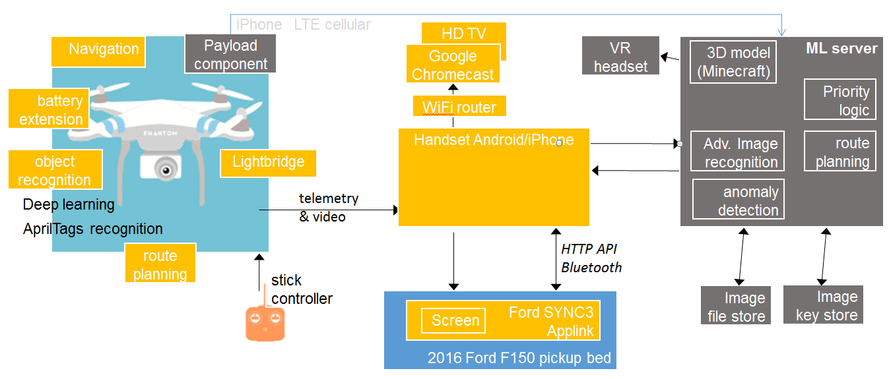

# Proposal

## Physical (Hardware) Components from DJI:
* DJI's Phantom 3 Pro flying platform (for practice before M100 is available)
* DJI's Matrice 100 (M100) flying platform

* Antenna sticking up from unit keeps the copter from hitting the ceiling.
* DJI’s Manifold (portable computation platform) the "High performance computing designed for the DJI Onboard SDK to bring true intelligence to flying platforms."
* DJI’s ZenMuse X3 (4K gimbal mounted camera)
* DJI’s Guidance (5 directions of depth sensing), for visual sensing.
* Lightbridge bult in 2.4G Full HD
	http://www.dji.com/product/dji-lightbridge

* F150 flatbed truck to transport the drone (operated by DJI personnel)
* SYNC hardware compatible with Samsung smartphone (Galexy SIII).

## Additional Physical (Hardware) Components:
* Bracket and straps to hold iPhone etc in accesory bay
* iPhone
* Lightning cable to iPhone
* Occipital sensor connected to iPhone

* Ford SYNC prototyping box

   

   NOTE: Team member Richard Puckett's team won the Ford SYNC Challenge 2015.
   Picture is [3:30] into the video on ConcurLabs.com.

### Supplies and Tooling
* Box to mail copter via UPS/FedEx
* Battery tester
* Extra Battery
* Battery chargers
* Replacements for damage (propellers, etc.)
* Example AprilTags for objects and vehicle
* Tools to repair units
* Light meter
* Portable lights for crew to work
* Video camera with microphone to record event
* Tripod for camera

## Software Components
* DJI’s Mobile SDK for iOS and Android, 
   * DJI’s Guidance SDK
   * DJI’s Onboard SDK
   * Ford API Library and Emulator
   * DJI emulator

Photo credit: https://developer.dji.com/showcase/ugcs/
